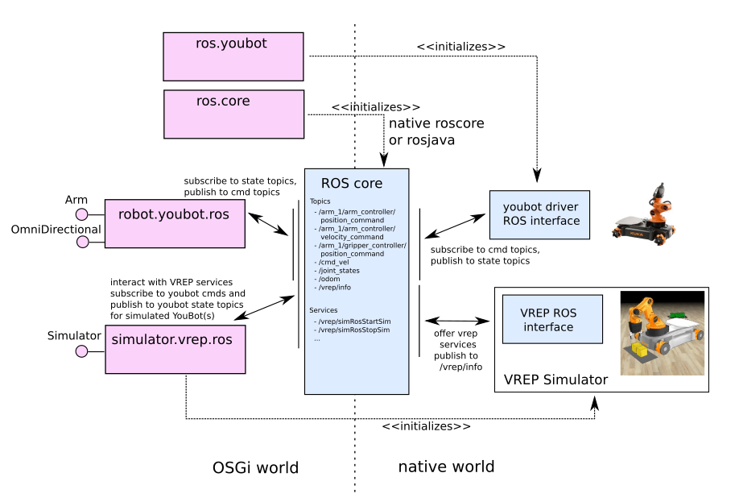

This repository contains OSGi bundles to interface with ROS (Robot Operating System)

The ros.core OSGi bundle will use either a natively running roscore instance, or start a new roscore instance based on the rosjava implementation. OSGi bundles can be provided to also start rosnodes that are installed on the system, such as the youbot drivers. This is implemented by starting an external process from within the OSGi bundle.

The simulator.vrep.ros bundle (starts and) interacts with a VREP simulator instance via the `/vrep/*` ROS services and topics. Core simulator functionality is made available as a Simulator OSGi service.

Interacting with a Youbot via ROS happens via the `/arm_1/*` and `/cmd_vel` command topics and reading its state via `/joint_states` and `/odom` topics. These topics are picked up by the robot.youbot.ros bundle which exposes the Youbot functionality as Arm and OmniDirectional (=Youbot base) OSGi services. 

To have an identical interface to the Youbot when simulating in VREP, the simulator.vrep.ros bundle will also interact with a simulated Youbot object in VREP and use the VREP ROS API to translate from VREP to the actual Youbout ROS topics.

In the native world other ROS nodes can be started and connect to the system. In the OSGi world new bundles can subscribe/publish to other ROS topics and expose these as nice OSGi services.

In order to subscribe/publish to ROS topics, or call ROS services, the required messages have to be available in the Java runtime. The be.iminds.iot.ros.msgs.generator bundle can be used to generate the required Java types that can then be wrapped in an OSGi bundle. It provides a generate command that will place all generated .java files in the generated_msgs directory. Optionally one can provide a custom ROS package path with the command.
